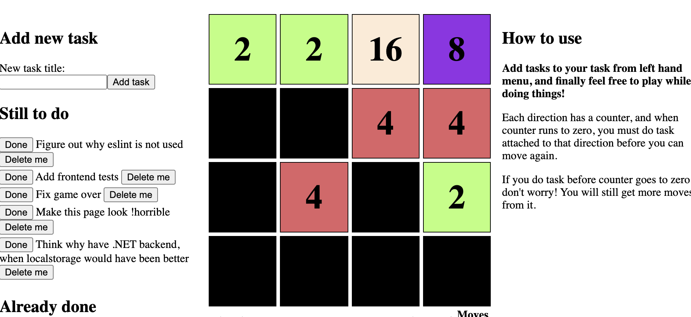

# TODO 2048

Finally the perfect combination of wasting time and getting things done. Todo application and 2048 clone in one app.

## How to run

1. Install .NET 5 and Node.js
1. `git clone https://github.com/alantto/todo-2048.git`
1. `cd todo-2048/src/Todo.Web`
1. `dotnet dev-certs https --trust`
1. `dotnet run`
1. Open another terminal and run 
1. `cd todo-2048/src/Todo.Client`
1. `npm i`
1. `npm run start`

